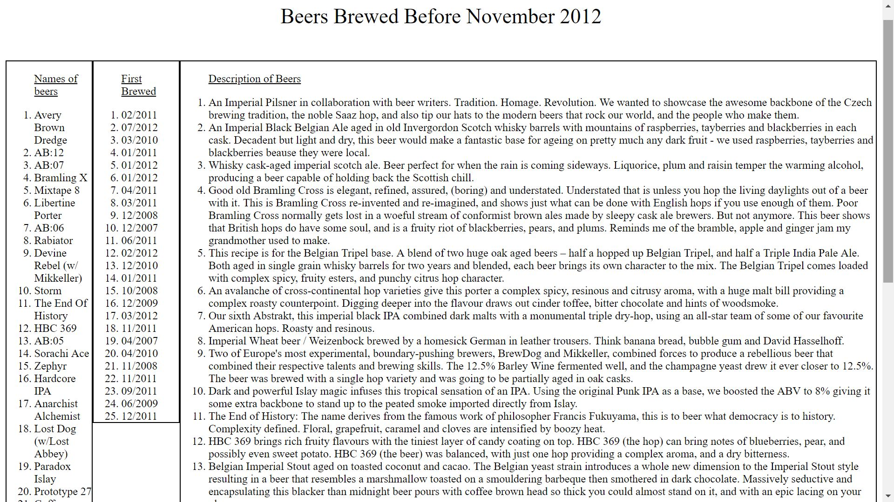

Beer API

The goal with this assignment was to include an existing API into my application. For this assigment I chose to use Brewdog's API. They are a beer company with a long list of beers so I chose to display a couple of facts about some beers that they brew.

Link to project:https://rakimdevcraig.github.io/BeerAPI/

How It's Made:
Tech used: HTML, CSS, JavaScript, jQuery, APIS
This API was an easy one to work with I didn't have to apply for any keys and the documentation provided clear, concise directions on how to use it. From the documentation I found out that I can get the info for beer names, the date they were first brewed and a short description of each beer. I decided to get this information for all of the beers brewed before november 2012. With these parameters I made an ajax request in javascript and had my parameters placed into an li. After I got the values to print into the DOM I had to use CSS to give more room for the description of the beer column because it had way more words than the other 2 columns.

Lessons Learned:
This project helped my familiarity with incorporating APIS into my own apps. Before I found this one I had to sift through numerous APIS just to find out they were no longer in use. This has led me to testing out an API in the early stages of projects so I don't waste time on something that doesn't work.

Examples:
Take a look at these couple examples that I have in my own portfolio:
